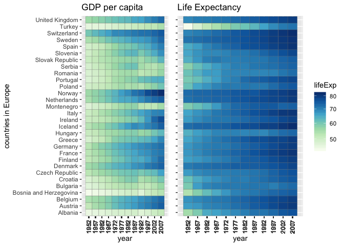

hw03-rasiimwe.Rmd
================
Rebecca Asiimwe
2018-09-27

STAT545 Homework 03: Data Manipulation and Exploration using dplyr accompanied by visualizations using ggplot2.
===============================================================================================================

### Homework Tasks:

-   [Get the maximum and minimum of GDP per capita for all continents.](#get-the-maximum-and-minimum-of-gdp-per-capita-for-all-continents.)
-   [Compute a trimmed mean of life expectancy for different years. Or a weighted mean, weighting by population. Just try something other than the plain vanilla mean.](#compute-a-trimmed-mean-of-life-expectancy-for-different-years.-or-a-weighted-mean,-weighting-by-population.-just-try-something-other-than-the-plain-vanilla-mean)
-   [How is life expectancy changing over time on different continents?](#how-is-life-expectancy-changing-over-time-on-different-continents)
-   [Find countries with interesting stories. Open-ended and, therefore, hard. Promising but unsuccessful attempts are encouraged. This will generate interesting questions to follow up on in class.](#find-countries-with-interesting-stories.-open-ended-and,-therefore,-hard.-promising-but-unsuccessful-attempts-are-encouraged.-this-will-generate-interesting-questions-to-follow-up-on-in-class)
-   [But I want to do more](#but-i-want-to-do-more)

#### Loading all required packages for this assignment

``` r
suppressPackageStartupMessages(library(tidyverse))
```

    ## Warning: package 'dplyr' was built under R version 3.5.1

``` r
suppressPackageStartupMessages(library(gapminder))
suppressPackageStartupMessages(library(ggplot2))
suppressPackageStartupMessages(library(knitr))
suppressPackageStartupMessages(library(RColorBrewer))
suppressPackageStartupMessages(library(cowplot))
suppressPackageStartupMessages(library(gridExtra))
suppressPackageStartupMessages(library(directlabels))
suppressPackageStartupMessages(library(ggrepel))
suppressPackageStartupMessages(library(reshape2))
suppressPackageStartupMessages(library(xtable))
suppressPackageStartupMessages(library(pander))
suppressPackageStartupMessages(library(stargazer))
```

Homework Task 1:
----------------

#### Get the maximum and minimum of GDP per capita for all continents.

``` r
min_max_gdpPercap <- gapminder %>% 
  group_by(continent) %>% 
  summarise(min_gdpPercap=min(gdpPercap), max_gdpPercap=max(gdpPercap)) %>% 
  arrange(min_gdpPercap) 
  kable(min_max_gdpPercap)
```

| continent |  min\_gdpPercap|  max\_gdpPercap|
|:----------|---------------:|---------------:|
| Africa    |        241.1659|        21951.21|
| Asia      |        331.0000|       113523.13|
| Europe    |        973.5332|        49357.19|
| Americas  |       1201.6372|        42951.65|
| Oceania   |      10039.5956|        34435.37|

Above is a table that shows the minimum and maximum gdp per capita for each continent. I would like to have a grouped bar plot that represents this data, however, the data is not in a form that can allow me have a grouped bar plot. So I thought of an interesting way of having 2 fields instead of three with a one-to-one mapping of continent to either minimum or maximum gdp per capita. I accomplished this using the rbind() function to combine two dataframes by row. Below is the break down of this task.

#### Creating a dataframe to support my desired grouped bar plot

``` r
# creating a dataframe of only minimum gdp per capita:
min_gdpPercap <- gapminder %>% 
  group_by(continent) %>% 
  summarise(gdpPercap=min(gdpPercap), value='min_gdppc') %>% 
  arrange(gdpPercap) 

# creating a dataframe of only maximum gdp per capita:
max_gdpPercap <- gapminder %>% 
  group_by(continent) %>% 
  summarise(gdpPercap=max(gdpPercap), value='max_gdppc') %>% 
  arrange(gdpPercap)

# combining the two dataframes using rbind():
min_max_gdpPercap <-rbind(min_gdpPercap,max_gdpPercap)
min_max_gdpPercap <- as.data.frame(min_max_gdpPercap)
min_max_gdpPercap <- min_max_gdpPercap %>%  
  rename(minmax=value)

min_max <- min_max_gdpPercap %>% 
  ggplot(aes(continent, gdpPercap,fill=minmax )) + 
  geom_bar(position="dodge", stat="identity")+
  scale_fill_manual(values = c("firebrick", "steelblue"))+
  theme_light()+  
  theme(axis.text.x=element_text(angle=90,hjust=1,vjust=0.5))


my_theme <- ttheme_default(colhead=list(fg_params=list(col="navyblue", fontface=4L)),
  rowhead=list(fg_params=list(col="red4", fontface=3L))) #specifying my table theme

grid.arrange(tableGrob((min_max_gdpPercap),theme = my_theme),min_max,nrow=1,widths = 3:4) #having a table and plot side-by-side. In here I also call my theme and specify the grid arangement. I also specified the width for both the table and plot.
```


To plot a table and plot side by side, I visited [this](https://cran.r-project.org/web/packages/gridExtra/vignettes/tableGrob.html) helful cran extract at. From the above table and plot, we can deduce that Asia had the highest maximum gdp per capita while Africa had the lowest. We can also see that Africa had the lowest minimum gdp per capita, followed by Asia, whild Oceania had the highest lowest gdp per capita.

Homework Task 2:
----------------

#### Compute a trimmed mean of life expectancy for different years. Or a weighted mean, weighting by population. Just try something other than the plain vanilla mean.

#### Computing the trimmed mean life expectancy for different years:

``` r
trimmed_mean <- gapminder %>% 
  group_by(year) %>% 
  summarise(trmd_mean=mean((lifeExp),trim=0.10))  #here 0.1 is the fraction of observations to be trimmed before the mean lifexpectancy is computed 

t_mean <- trimmed_mean %>% 
  ggplot(aes(year,trmd_mean))+
  geom_bar(stat = "identity", width=4, fill = "gray80", color="gray60")+
  labs(y="trimmed_mean")+
  theme_light()+  
  scale_x_continuous("year", labels = as.character(trimmed_mean$year), breaks = trimmed_mean$year)

t_mean <- trimmed_mean %>% 
  ggplot(aes(year,trmd_mean))+
  geom_bar(stat = "identity", width=4, fill = "gray80", color="gray60")+
  labs(y="trimmed_mean")+
  theme_light()+  
  scale_x_continuous("year", labels = as.character(trimmed_mean$year), breaks = trimmed_mean$year)

grid.arrange(tableGrob((trimmed_mean)),t_mean,nrow=1,widths = 3:4)
```


The generic function for the [(trimmed) arithmetic mean](https://stat.ethz.ch/R-manual/R-devel/library/base/html/mean.html) is a method of averaging that removes a small designated percentage of the largest and smallest values before calculating the mean. From the above table and plot, we can see and deduce that over the years, the mean life expectancy gradually increased.

Homework Task 3:
----------------

### How is life expectancy changing over time on different continents?

#### I will begin by creating a dataframe I can work with for this task.

``` r
mean_lifeExp_cont <- gapminder %>% 
  group_by(continent, year) %>% 
  summarise(mean_lifeExp = mean(lifeExp))

mean_lifeExp_cont %>% 
  head(20) %>% 
  kable
```

| continent |  year|  mean\_lifeExp|
|:----------|-----:|--------------:|
| Africa    |  1952|       39.13550|
| Africa    |  1957|       41.26635|
| Africa    |  1962|       43.31944|
| Africa    |  1967|       45.33454|
| Africa    |  1972|       47.45094|
| Africa    |  1977|       49.58042|
| Africa    |  1982|       51.59287|
| Africa    |  1987|       53.34479|
| Africa    |  1992|       53.62958|
| Africa    |  1997|       53.59827|
| Africa    |  2002|       53.32523|
| Africa    |  2007|       54.80604|
| Americas  |  1952|       53.27984|
| Americas  |  1957|       55.96028|
| Americas  |  1962|       58.39876|
| Americas  |  1967|       60.41092|
| Americas  |  1972|       62.39492|
| Americas  |  1977|       64.39156|
| Americas  |  1982|       66.22884|
| Americas  |  1987|       68.09072|

This table is too long and is being truncated when passed through the tableGrob function and table headers not seen. Because of this, I decided to call the kable() function and defined the number of rows to be shown - mostly to show the structure of the table.

#### Below are plots showing how life expectancy is changing over time on different continents

``` r
p1 <- mean_lifeExp_cont %>% 
  ggplot(aes(year, mean_lifeExp,color=continent))+
  geom_line(size=0.5)+
  scale_color_manual(values=continent_colors)+ #I am using colors provided by the gapminder package
  geom_point(shape=3,stat='summary', fun.y=sum) +
  stat_summary(fun.y=sum, geom="line")+ 
  theme_bw()+
  scale_x_continuous(breaks=mean_lifeExp_cont$year) 

p2<- mean_lifeExp_cont %>%
  ggplot(aes(year, continent,  fill = mean_lifeExp)) +
  geom_tile(color = "gray40") +
  scale_x_continuous(expand=c(0,0)) +
  scale_fill_gradient(low = "red", high = "midnightblue")+
  theme_classic()   
  

p3<-mean_lifeExp_cont %>% 
  ggplot(aes(reorder(continent, mean_lifeExp), mean_lifeExp))+
  geom_col(aes(fill = mean_lifeExp), size=0.1)+ 
  coord_flip()+#flip the axes for a horizontal representation - I prefered horizontal bars
 scale_fill_gradient2(low = "white", mid="red", high = "midnightblue")+theme_light()+labs(y="Mean Life Expectancy", x="Continent") #because of coord flip, the labels change too!
  
plot_grid(p1, p2,p3,labels = "AUTO", nrow=3)
```


From the above plots, we can see that over the years, In figure **A**, we can see that the the mean life expectancy gradually improved over the years, in **B** we see that Ocean had the highest gradual improvement in life expectancy followed by Europe while Africa consistently had a low life expectancy over the years. In **C**, we see both the gradual inprovement of mean life expectancy and its distribution in the various continents with Oceania having the highest while Africa had the lowes.

Homework Task 4:
----------------

#### Find countries with interesting stories. Open-ended and, therefore, hard. Promising but unsuccessful attempts are encouraged. This will generate interesting questions to follow up on in class.

#### Idnentifying continent specific outliers

I will begin with a preliminary sniff of all continents to identify those with interesting patterns that may hint on the posibility of them having countries with interesting stories.

``` r
ggplot(gapminder, aes(gdpPercap,lifeExp)) + 
  scale_x_log10()+geom_point(size=0.1, alpha=0.5) + 
  facet_wrap(~continent)+theme_bw()+
  geom_smooth(method="lm", size=0.3, color="red")
```


From the above plot, **Asia**, **Europe** and **Africa** seem to have some countires that are off the central tendency of the respective continents. Let's take a closer look into them. Below, I will identify the outliers in each continent. This was a [helful resource](https://github.com/slowkow/ggrepel/issues/17) resource. [This resource](https://socviz.co/workgeoms.html) was helpful too.

#### Identifying outliers in Asia

``` r
gapminder %>% 
  filter(continent=="Asia") %>% 
  ggplot(aes(reorder(country, gdpPercap), gdpPercap)) +
  geom_boxplot(outlier.colour="firebrick",fill = "steelblue") +  
  scale_y_log10()+
  theme(axis.text.x=element_text(angle=90,hjust=1,vjust=0.5))+#here I "rotate" the x axis lables to make them more visible 
  labs(y="GDP Per Capita", x="Countries in Asia")
```


From the above plot, we can see that **Myanmar**, **Cambodia**, **Bangladesh**, **Vietnam** and **Saudi Arabia** are the outliers in this dataset, based on the GDP per capita. **Kuwait** also seems to have an interestingly high GDP per capita! We shall look further into some of these countries.

#### Identifying outliers in Africa

``` r
gapminder %>% 
  filter(continent=="Africa") %>% 
  ggplot(aes(reorder(country, gdpPercap), gdpPercap)) +
  geom_boxplot(outlier.colour="firebrick",fill = "steelblue") +  
  scale_y_log10()+
  theme(axis.text.x=element_text(angle=90,hjust=1,vjust=0.5))+
  labs(y="GDP Per Capita", x="Countries in Africa")
```


Africa has quite a number of outliers. We'll look further into this and pick out just a few interesting countries.

#### Identifying outliers in Europe

``` r
gapminder %>% 
  filter(continent=="Europe") %>% 
  ggplot(aes(reorder(country, gdpPercap), gdpPercap)) +
  geom_boxplot(outlier.colour="firebrick",fill = "steelblue") +  
  scale_y_log10()+
  theme(axis.text.x=element_text(angle=90,hjust=1,vjust=0.5))+
  labs(y="GDP Per Capita", x="Countries in Europe")
```


Not as dramatic as Africa :smile:, but let's see what other plots tell us.

#### Below, I fiuther look into continent specific countries

``` r
Africa_check <- gapminder %>% filter(continent=="Africa") 
Africa_check %>% 
  ggplot() + 
  geom_line(aes(year, gdpPercap, color = country)) +
  geom_text(data = Africa_check %>% filter(year == last(year)), aes(label = country, x = year + 0.5, y = gdpPercap, color = country)) + 
  guides(color = FALSE) + 
  theme_bw() + 
  scale_x_continuous(breaks = scales::pretty_breaks(10))
```


These are quite a number of countries with so many overlapping lines. But we can see that Gabon and Mauritania were almost neck to neck for the highest gdp per capita. We also see that both countries experienced a sharp drop in 1974 and 1874 respectively. However, this plot is not so helpful because of the numberous countries. Below are other types of plots that will be of great help in picking out countries of interest.

``` r
Asia_check <- gapminder %>% filter(continent=="Asia") 
Asia_check %>% 
  ggplot() + 
  geom_line(aes(year, gdpPercap, color = country)) +
  geom_text(data = Asia_check %>% filter(year == last(year)), aes(label = country,x = year + 0.5,y = gdpPercap,color = country)) + 
  guides(color = FALSE) + theme_bw() + 
  scale_x_continuous(breaks = scales::pretty_breaks(10))
```


Still see an unclear representation with Asia, however we can see an interestingly high gdp per capita in Kuwait with a sharp drop after 1972. This also confirms that representation seen in the box plots above.

``` r
Europe_check <- gapminder %>% filter(continent=="Europe") 
Europe_check %>% 
  ggplot() + 
  geom_line(aes(year, gdpPercap, color = country)) +
  geom_text(data = Europe_check %>% filter(year == last(year)), aes(label = country, x = year + 0.5,y = gdpPercap, color = country)) + 
  guides(color = FALSE) + theme_bw()+
  scale_x_continuous(breaks = scales::pretty_breaks(10))
```


We still see a gradual improvement in gdp per capita over the years. Ireland seems to have a striking improvement after 1987. We also see a rise in gdp per capita of Norway over Switzerland in 1985.

Let's see whether other representations can help us identify previously identified outliers.

### Sanity Check into all continents fo interesting countries

From all the above plots, we seem to see some countries with interesting patterns. I will do a sanity check to confrim my findings. I will also look into life expectancy - out of curiosity.

#### Sanity check on Asia

``` r
 a1 <- gapminder %>%
  filter(continent == "Asia") %>%
  ggplot(aes(year, country,  fill = gdpPercap)) +
  geom_tile(color = "gray40") +
  scale_x_continuous(expand=c(0,0)) +
  scale_fill_gradientn(colors = brewer.pal(9, "GnBu"), trans = "sqrt") +
  theme_gray() + 
  ggtitle("GDP per capita") +
  ylab("countries in Asia") +
  theme(axis.text.x=element_text(angle=90,hjust=1,vjust=0.5))+
  xlab("year")+theme(legend.position="none")+
  scale_x_continuous(breaks=gapminder$year)
```

    ## Scale for 'x' is already present. Adding another scale for 'x', which
    ## will replace the existing scale.

``` r
a2 <- gapminder %>%
  filter(continent == "Asia") %>%
  ggplot(aes(year, country,  fill = lifeExp)) +
  geom_tile(color = "gray40") +
  scale_x_continuous(expand=c(0,0)) +
  scale_fill_gradientn(colors = brewer.pal(9, "GnBu"), trans = "sqrt") + 
  theme_gray() +  
  ggtitle("Life Expectancy") +
  theme(axis.title.y=element_blank())+ #removing y axix label to right plot as the lables on left plot still apply to right = removing redundacy. Here I leave the axis labels for readability but we can also remove them using: axis.text.y=element_blank()
  xlab("year")+
  theme(axis.text.x=element_text(angle=90,hjust=1,vjust=0.5))+ #rotating x lables to make them visible
  scale_x_continuous(breaks=gapminder$year) #calling all years from dataset as breaks
```

    ## Scale for 'x' is already present. Adding another scale for 'x', which
    ## will replace the existing scale.

``` r
plot_grid(a1, a2, ncol=2)
```


From the above two heatmaps, we can see that in the years upto ~1980, Kuwait had a very high gdp per capita that gradually reduced over the years - also as seen in a previous plot. I also notice a pattern in the plot on life expectancy where we see Cambodia's life expectancy strikingle low 1977!!!

#### Sanity check on Africa

``` r
af1 <- gapminder %>%
  filter(continent == "Africa") %>%
  ggplot(aes(year, country,  fill = gdpPercap)) +
  geom_tile(color = "gray40") +
  scale_x_continuous(expand=c(0,0)) +
  scale_fill_gradientn(colors = brewer.pal(9, "GnBu"), trans = "sqrt") +
  theme_gray() + 
  ggtitle("GDP per capita") +
  ylab("countries in Africa") +
  theme(axis.text.x=element_text(angle=90,hjust=1,vjust=0.5))+
  xlab("year")+theme(legend.position="none")+
  scale_x_continuous(breaks=gapminder$year)
```

    ## Scale for 'x' is already present. Adding another scale for 'x', which
    ## will replace the existing scale.

``` r
af2 <- gapminder %>%
  filter(continent == "Africa") %>%
  ggplot(aes(year, country,  fill = lifeExp)) +
  geom_tile(color = "gray40") +
  scale_x_continuous(expand=c(0,0)) +
  scale_fill_gradientn(colors = brewer.pal(9, "GnBu"), trans = "sqrt") + 
  theme_gray() +  
  ggtitle("Life Expectancy") +
  theme(axis.title.y=element_blank())+ 
  xlab("year")+
  theme(axis.text.x=element_text(angle=90,hjust=1,vjust=0.5))+ 
  scale_x_continuous(breaks=gapminder$year) 
```

    ## Scale for 'x' is already present. Adding another scale for 'x', which
    ## will replace the existing scale.

``` r
plot_grid(af1, af2, ncol=2)
```


From the above plots, we can see very high gdp per capitas in Libya and Garbon between 1964 and 1979 and in 1977 respectively. On the right we also see a strikingly low life expectacy in Rwanda. These low values are attributed to [Rwanda genocide](https://en.wikipedia.org/wiki/Rwandan_genocide) in which many people lost their lives.

#### Sanity check on Europe

``` r
Eur1 <- gapminder %>%
  filter(continent == "Europe") %>%
  ggplot(aes(year, country,  fill = gdpPercap)) +
  geom_tile(color = "gray40") +
  scale_x_continuous(expand=c(0,0)) +
  scale_fill_gradientn(colors = brewer.pal(9, "GnBu"), trans = "sqrt") +
  theme_gray() + 
  ggtitle("GDP per capita") +
  ylab("countries in Europe") +
  theme(axis.text.x=element_text(angle=90,hjust=1,vjust=0.5))+
  xlab("year")+theme(legend.position="none")+
  scale_x_continuous(breaks=gapminder$year)
```

    ## Scale for 'x' is already present. Adding another scale for 'x', which
    ## will replace the existing scale.

``` r
Eur2 <- gapminder %>%
  filter(continent == "Europe") %>%
  ggplot(aes(year, country,  fill = lifeExp)) +
  geom_tile(color = "gray40") +
  scale_x_continuous(expand=c(0,0)) +
  scale_fill_gradientn(colors = brewer.pal(9, "GnBu"), trans = "sqrt") + 
  theme_gray() +  
  ggtitle("Life Expectancy") +
  theme(axis.title.y=element_blank())+ 
  xlab("year")+
  theme(axis.text.x=element_text(angle=90,hjust=1,vjust=0.5))+ 
  scale_x_continuous(breaks=gapminder$year) 
```

    ## Scale for 'x' is already present. Adding another scale for 'x', which
    ## will replace the existing scale.

``` r
plot_grid(Eur1, Eur2, ncol=2)
```



Here, we dont see patters as interesting as those seen in previous plots, but Turkey seems to have a consistently low but gradually improving life expectancy. Its gdp per capita, Bulgaria's and Albanias are equally low.

### A closer look into countries with intersting stories (I will focus on Cambodia, Rwanda and Kuwait)

#### A closer look into Cambodia

``` r
c1 <- gapminder %>% 
  filter(country=="Cambodia") %>% 
  ggplot(aes(year, lifeExp))+
  geom_line(size=0.5)+
  geom_point(shape=3,stat='summary', fun.y=sum) +
  stat_summary(fun.y=sum, geom="line")+ 
  theme_bw()+ 
  labs(title="Cambodia over the years")+
  scale_color_manual(values=c("red"))+
  scale_x_continuous(breaks=gapminder$year)+
  geom_vline(xintercept=1977, col = "red")

c2 <-gapminder %>% 
  filter(country=="Cambodia") %>% 
  ggplot(aes(year, gdpPercap))+
  geom_line(size=0.5)+
  scale_color_manual(values=c("blue"))+
  geom_point(shape=3,stat='summary', fun.y=sum) +
  stat_summary(fun.y=sum, geom="line")+ 
  theme_bw()+
  scale_x_continuous(breaks=gapminder$year) 

c3 <-gapminder %>% 
  filter(country=="Cambodia") %>% 
  ggplot(aes(year, pop))+
  geom_line(size=0.5)+
  geom_point(shape=3,stat='summary', fun.y=sum) +
  stat_summary(fun.y=sum, geom="line")+ 
  theme_bw()+
  scale_x_continuous(breaks=gapminder$year)+
  labs(y="population")

plot_grid(c1, c2, c3, labels = "AUTO", nrow=3, ncol=1)
```


As earlier mentioned, we see that Cambodia had a strikingly low life expectancy in 1977. What could have caused this? An [online review](https://www.ncbi.nlm.nih.gov/books/NBK223346/) shows that Cambodia was aflicted by war in which many people died. Read more. However, we see a sharp rise after 1977 and a stready improvement from 1882 onward. We also see a slight decline in gdp per capita during the years in which the cival war begun but with a steady improvement thereon.

#### A closer look into Rwanda

``` r
r1 <- gapminder %>% 
  filter(country=="Rwanda") %>% 
  ggplot(aes(year, lifeExp))+
  geom_line(size=0.5)+
  geom_point(shape=3,stat='summary', fun.y=sum) +
  stat_summary(fun.y=sum, geom="line")+ 
  theme_bw()+ 
  labs(title="Rwanda over the years")+
  scale_color_manual(values=c("red"))+
  scale_x_continuous(breaks=gapminder$year)+geom_vline(xintercept=1992, col = "red") 

r2 <-gapminder %>% 
  filter(country=="Rwanda") %>% 
  ggplot(aes(year, gdpPercap))+
  geom_line(size=0.5)+
  scale_color_manual(values=c("blue"))+
  geom_point(shape=3,stat='summary', fun.y=sum) +
  stat_summary(fun.y=sum, geom="line")+ 
  theme_bw()+
  scale_x_continuous(breaks=gapminder$year)+
  geom_vline(xintercept=1967, col = "red")+
  geom_vline(xintercept=1982, col = "red") 

r3 <-gapminder %>% 
  filter(country=="Rwanda") %>% 
  ggplot(aes(year, pop))+
  geom_line(size=0.5)+
  geom_point(shape=3,stat='summary', fun.y=sum) +
  stat_summary(fun.y=sum, geom="line")+ 
  theme_bw()+
  scale_x_continuous(breaks=gapminder$year)+
  labs(y="population") 

plot_grid(r1, r2, r3, labels = "AUTO", nrow=3, ncol=1)
```


In line with previously seen analyses, because of the Rwandan genocide, we see a strikingly lows life expectancy in Rwanda in 1992. We also see an interesting pattern in the gdp per capita of this country with the lowest being reported in 1967.

#### A closer look into Kuwait

``` r
k1 <- gapminder %>% 
  filter(country=="Kuwait") %>% 
  ggplot(aes(year, lifeExp))+
  geom_line(size=0.5)+
  geom_point(shape=3,stat='summary', fun.y=sum) +
  stat_summary(fun.y=sum, geom="line")+ 
  theme_bw()+ 
  labs(title="Kuwait over the years")+
  scale_color_manual(values=c("red"))+
  scale_x_continuous(breaks=gapminder$year) 

k2 <-gapminder %>% 
  filter(country=="Kuwait") %>% 
  ggplot(aes(year, gdpPercap))+
  geom_line(size=0.5)+
  scale_color_manual(values=c("blue"))+
  geom_point(shape=3,stat='summary', fun.y=sum) +
  stat_summary(fun.y=sum, geom="line")+ 
  theme_bw()+
  scale_x_continuous(breaks=gapminder$year)+
  geom_vline(xintercept=1972, col = "red")+
   geom_vline(xintercept=1987, col = "red") 

k3 <-gapminder %>% 
  filter(country=="Kuwait") %>% 
  ggplot(aes(year, pop))+
  geom_line(size=0.5)+
  geom_point(shape=3,stat='summary', fun.y=sum) +
  stat_summary(fun.y=sum, geom="line")+ 
  theme_bw()+
  scale_x_continuous(breaks=gapminder$year)+
  labs(y="population")

plot_grid(k1, k2, k3, labels = "AUTO", nrow=3, ncol=1)
```


From the above plot, we see an almost steady improvement in life expectancy and population of Kuwait over the years, however as earlier seen, there was a steady decline in the gdp per capita of Kuwait after 1972.

### But I want to do more!!

In the above sections I present the usage of two awesome functions and application of grid.arrange (from the gridExtra package) and tableGrob in getting a table and figure side-by-side. Below, I show how we can apply the **xtalble()** and **pander()** functions in creating more exciting tables that we can also use in latex and microsoft word.

Homework Task 5 :
-----------------

For this section, I will look into the spread of GDP per capita within the continents and use xtable and pander functions to generate tables.

To determine the spread of GDP per capita within the continents, first, I needed to look up the statistical meaning of "spread" :smile:. I found [this resource](https://www.statisticshowto.datasciencecentral.com/measures-of-spread/) very useful in enlightening me about the necessary terms that define the spread of a variable in a dataset.

These are the **meassures of spread** that I applied to the GDP per capita within continents: 1. The **Range** 2. The **Standard deviation**, 3. The **variance** and finally, 4. **Quartiles**.

#### 1. Range

The range here is defined by the minimum and maximum gdp per capita. This was presented in the previous task(1) where I derived the minimum and maximum gdp per capitas of each continent. A case in point is Asias's range below that aligns to the previously extracted minimum and maximum gdp per capita:

``` r
gapminder %>% 
  filter(continent=='Asia') %>% 
  select(gdpPercap) %>% 
  range
```

    ## [1]    331.0 113523.1

#### 2. The **standard deviation**, **Variance** and **Quartiles**

In my research, I also [found](https://www.statisticshowto.datasciencecentral.com/probability-and-statistics/interquartile-range/) a valuale meassure called the interquartile range that is a meassure of where the middle fifty lie in a dataset - a meassure of variability that denotes the difference between the first and third quartiles.

##### Creating a dataframe with the meassures of spread of GDP per capita within the continents

``` r
spread_gdpPercap <- gapminder %>% 
  group_by(continent) %>% 
  summarise(sd_gdpPercap=sd(gdpPercap), var_gdpPercap=var(gdpPercap),quartiler_gdpPercap = IQR(gdpPercap)) %>% 
  arrange(sd_gdpPercap) 
```

##### Computing continent specific gdp per capita quantiles. [This](https://stackoverflow.com/questions/26232304/r-how-to-find-the-quantile) was a great resource.

``` r
#Africa
Africa<-gapminder %>% 
   filter(continent=="Africa") %>% 
  select(gdpPercap) 
afr<- t(as.data.frame(quantile(Africa$gdpPercap,seq(0,1, by = 0.25)) ))
rownames(afr)='Africa'

#Asia
Asia<-gapminder %>% 
   filter(continent=="Asia") %>% 
  select(gdpPercap) 
asi<- t(as.data.frame(quantile(Asia$gdpPercap,seq(0,1, by = 0.25)) ))
 rownames(asi)='Asia'
 
#Americas
Americas<-gapminder %>% 
   filter(continent=="Americas") %>% 
  select(gdpPercap) 
ame<- t(as.data.frame(quantile(Americas$gdpPercap,seq(0,1, by = 0.25)) ))
 rownames(ame)='America'
 
#Europe
Europe<-gapminder %>% 
   filter(continent=="Europe") %>% 
  select(gdpPercap) 
eur<- t(as.data.frame(quantile(Europe$gdpPercap,seq(0,1, by = 0.25)) ))
 rownames(eur)='Europe'
 
#Oceania
Oceania<-gapminder %>% 
  filter(continent=="Oceania") %>% 
  select(gdpPercap) 
oce<- t(as.data.frame(quantile(Oceania$gdpPercap,seq(0,1, by = 0.25)) ))
 rownames(oce)='Oceania'
 
continent_quantiles <-as.data.frame(rbind(afr,oce, ame,eur,asi))

meassures_of_spread <- cbind(spread_gdpPercap,continent_quantiles)
```

#### First I will show the table variation using kable

``` r
kable(meassures_of_spread)
```

|         | continent |  sd\_gdpPercap|  var\_gdpPercap|  quartiler\_gdpPercap|          0%|        25%|        50%|        75%|       100%|
|---------|:----------|--------------:|---------------:|---------------------:|-----------:|----------:|----------:|----------:|----------:|
| Africa  | Africa    |       2827.930|         7997187|              1616.170|    241.1659|    761.247|   1192.138|   2377.417|   21951.21|
| Oceania | Oceania   |       6358.983|        40436669|              8072.258|  10039.5956|  14141.859|  17983.304|  22214.117|   34435.37|
| America | Americas  |       6396.764|        40918591|              4402.431|   1201.6372|   3427.779|   5465.510|   7830.210|   42951.65|
| Europe  | Europe    |       9355.213|        87520020|             13248.301|    973.5332|   7213.085|  12081.749|  20461.386|   49357.19|
| Asia    | Asia      |      14045.373|       197272506|              7492.262|    331.0000|   1056.993|   2646.787|   8549.256|  113523.13|

#### Applying the xtable function - this produces latex tables in PDF documents

``` r
xtable(meassures_of_spread)
```

    ## % latex table generated in R 3.5.0 by xtable 1.8-3 package
    ## % Tue Oct  2 21:00:43 2018
    ## \begin{table}[ht]
    ## \centering
    ## \begin{tabular}{rlrrrrrrrr}
    ##   \hline
    ##  & continent & sd\_gdpPercap & var\_gdpPercap & quartiler\_gdpPercap & 0\% & 25\% & 50\% & 75\% & 100\% \\ 
    ##   \hline
    ## Africa & Africa & 2827.93 & 7997187.31 & 1616.17 & 241.17 & 761.25 & 1192.14 & 2377.42 & 21951.21 \\ 
    ##   Oceania & Oceania & 6358.98 & 40436668.87 & 8072.26 & 10039.60 & 14141.86 & 17983.30 & 22214.12 & 34435.37 \\ 
    ##   America & Americas & 6396.76 & 40918591.10 & 4402.43 & 1201.64 & 3427.78 & 5465.51 & 7830.21 & 42951.65 \\ 
    ##   Europe & Europe & 9355.21 & 87520019.60 & 13248.30 & 973.53 & 7213.09 & 12081.75 & 20461.39 & 49357.19 \\ 
    ##   Asia & Asia & 14045.37 & 197272505.85 & 7492.26 & 331.00 & 1056.99 & 2646.79 & 8549.26 & 113523.13 \\ 
    ##    \hline
    ## \end{tabular}
    ## \end{table}

#### Applying the pander function

``` r
pander(meassures_of_spread)
```

<table>
<caption>Table continues below</caption>
<colgroup>
<col width="17%" />
<col width="15%" />
<col width="19%" />
<col width="20%" />
<col width="26%" />
</colgroup>
<thead>
<tr class="header">
<th align="center"> </th>
<th align="center">continent</th>
<th align="center">sd_gdpPercap</th>
<th align="center">var_gdpPercap</th>
<th align="center">quartiler_gdpPercap</th>
</tr>
</thead>
<tbody>
<tr class="odd">
<td align="center"><strong>Africa</strong></td>
<td align="center">Africa</td>
<td align="center">2828</td>
<td align="center">7997187</td>
<td align="center">1616</td>
</tr>
<tr class="even">
<td align="center"><strong>Oceania</strong></td>
<td align="center">Oceania</td>
<td align="center">6359</td>
<td align="center">40436669</td>
<td align="center">8072</td>
</tr>
<tr class="odd">
<td align="center"><strong>America</strong></td>
<td align="center">Americas</td>
<td align="center">6397</td>
<td align="center">40918591</td>
<td align="center">4402</td>
</tr>
<tr class="even">
<td align="center"><strong>Europe</strong></td>
<td align="center">Europe</td>
<td align="center">9355</td>
<td align="center">87520020</td>
<td align="center">13248</td>
</tr>
<tr class="odd">
<td align="center"><strong>Asia</strong></td>
<td align="center">Asia</td>
<td align="center">14045</td>
<td align="center">197272506</td>
<td align="center">7492</td>
</tr>
</tbody>
</table>

<table style="width:75%;">
<colgroup>
<col width="19%" />
<col width="11%" />
<col width="11%" />
<col width="11%" />
<col width="11%" />
<col width="11%" />
</colgroup>
<thead>
<tr class="header">
<th align="center"> </th>
<th align="center">0%</th>
<th align="center">25%</th>
<th align="center">50%</th>
<th align="center">75%</th>
<th align="center">100%</th>
</tr>
</thead>
<tbody>
<tr class="odd">
<td align="center"><strong>Africa</strong></td>
<td align="center">241.2</td>
<td align="center">761.2</td>
<td align="center">1192</td>
<td align="center">2377</td>
<td align="center">21951</td>
</tr>
<tr class="even">
<td align="center"><strong>Oceania</strong></td>
<td align="center">10040</td>
<td align="center">14142</td>
<td align="center">17983</td>
<td align="center">22214</td>
<td align="center">34435</td>
</tr>
<tr class="odd">
<td align="center"><strong>America</strong></td>
<td align="center">1202</td>
<td align="center">3428</td>
<td align="center">5466</td>
<td align="center">7830</td>
<td align="center">42952</td>
</tr>
<tr class="even">
<td align="center"><strong>Europe</strong></td>
<td align="center">973.5</td>
<td align="center">7213</td>
<td align="center">12082</td>
<td align="center">20461</td>
<td align="center">49357</td>
</tr>
<tr class="odd">
<td align="center"><strong>Asia</strong></td>
<td align="center">331</td>
<td align="center">1057</td>
<td align="center">2647</td>
<td align="center">8549</td>
<td align="center">113523</td>
</tr>
</tbody>
</table>

As we can see above, the table creater using pader() was split into two. If we do not want the table split, then we can run the following.

``` r
panderOptions('table.split.table', Inf)
pander(meassures_of_spread)
```

<table style="width:100%;">
<colgroup>
<col width="11%" />
<col width="10%" />
<col width="12%" />
<col width="13%" />
<col width="18%" />
<col width="6%" />
<col width="6%" />
<col width="6%" />
<col width="6%" />
<col width="6%" />
</colgroup>
<thead>
<tr class="header">
<th align="center"> </th>
<th align="center">continent</th>
<th align="center">sd_gdpPercap</th>
<th align="center">var_gdpPercap</th>
<th align="center">quartiler_gdpPercap</th>
<th align="center">0%</th>
<th align="center">25%</th>
<th align="center">50%</th>
<th align="center">75%</th>
<th align="center">100%</th>
</tr>
</thead>
<tbody>
<tr class="odd">
<td align="center"><strong>Africa</strong></td>
<td align="center">Africa</td>
<td align="center">2828</td>
<td align="center">7997187</td>
<td align="center">1616</td>
<td align="center">241.2</td>
<td align="center">761.2</td>
<td align="center">1192</td>
<td align="center">2377</td>
<td align="center">21951</td>
</tr>
<tr class="even">
<td align="center"><strong>Oceania</strong></td>
<td align="center">Oceania</td>
<td align="center">6359</td>
<td align="center">40436669</td>
<td align="center">8072</td>
<td align="center">10040</td>
<td align="center">14142</td>
<td align="center">17983</td>
<td align="center">22214</td>
<td align="center">34435</td>
</tr>
<tr class="odd">
<td align="center"><strong>America</strong></td>
<td align="center">Americas</td>
<td align="center">6397</td>
<td align="center">40918591</td>
<td align="center">4402</td>
<td align="center">1202</td>
<td align="center">3428</td>
<td align="center">5466</td>
<td align="center">7830</td>
<td align="center">42952</td>
</tr>
<tr class="even">
<td align="center"><strong>Europe</strong></td>
<td align="center">Europe</td>
<td align="center">9355</td>
<td align="center">87520020</td>
<td align="center">13248</td>
<td align="center">973.5</td>
<td align="center">7213</td>
<td align="center">12082</td>
<td align="center">20461</td>
<td align="center">49357</td>
</tr>
<tr class="odd">
<td align="center"><strong>Asia</strong></td>
<td align="center">Asia</td>
<td align="center">14045</td>
<td align="center">197272506</td>
<td align="center">7492</td>
<td align="center">331</td>
<td align="center">1057</td>
<td align="center">2647</td>
<td align="center">8549</td>
<td align="center">113523</td>
</tr>
</tbody>
</table>

As we can see above, there are many awesome and exciting ways of producing tables. The tables can also be produced to suit the kind of documents we are working on! It could be a **word file**, **latex** or **txt** file!!
